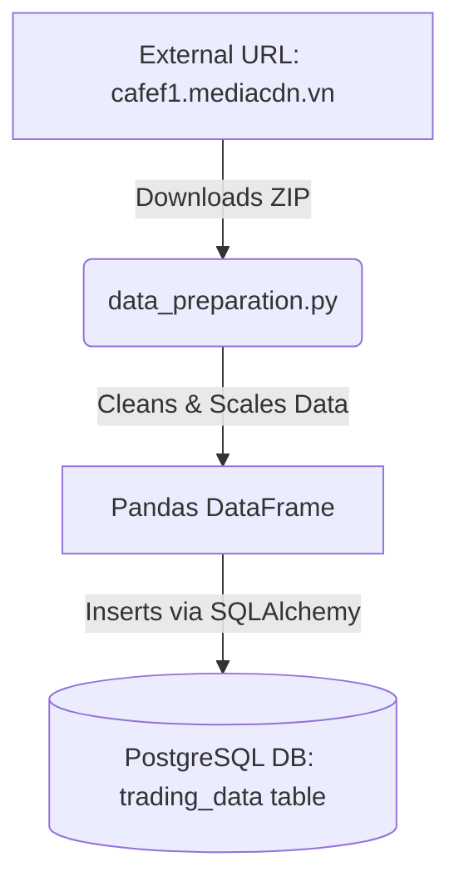
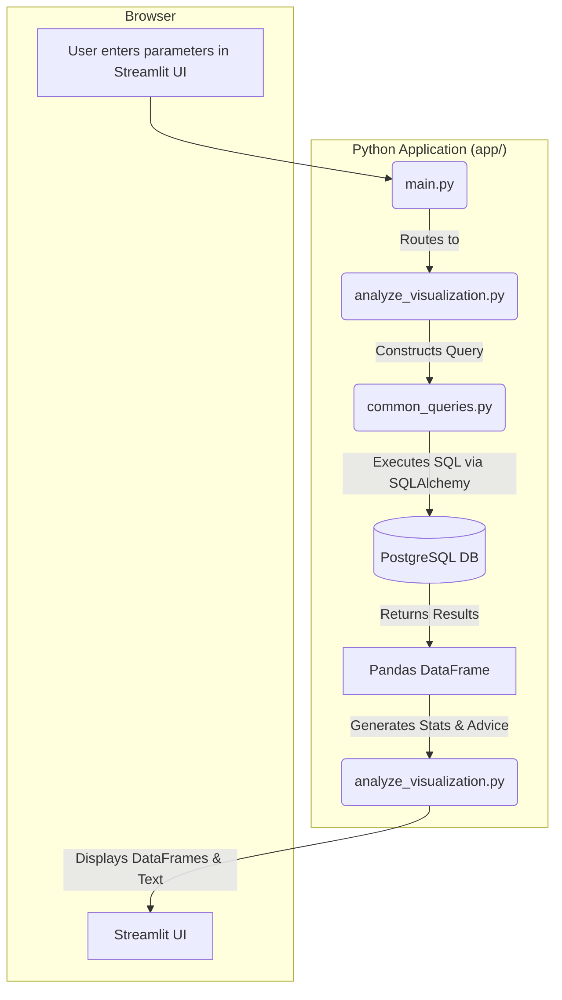

# Application Architecture

**Purpose:** This document describes the technical blueprint of the Stock Analysis App, including its structure, components, and how data moves through the system.

## 1. Technology Stack

- **Backend/UI:** Python, Streamlit
- **Data Processing:** Pandas, pandas-ta
- **Visualization:** Plotly
- **Database:** PostgreSQL
- **Database ORM/Driver:** SQLAlchemy, Psycopg2
- **Containerization:** Docker, Docker Compose
- **Environment Management:** `python-dotenv`

## 2. Folder Structure

A high-level overview of the project's directory structure.

```
/
├── .env                  # Environment variables (DB credentials)
├── docker-compose.yml    # Defines and orchestrates Docker services (app, db)
├── Dockerfile            # Instructions to build the Python application container
├── requirements.txt      # Python dependencies for product deployment
│
├── app/                  # Main application source code
│   ├── requirements.txt    # Python dependencies for local build
│   ├── main.py           # Application entry point, UI routing
│   ├── data_preparation.py # Data ingestion and database setup
│   ├── common_queries.py # Centralized SQL query components
│   ├── common_functions.py # Centralized Python analysis functions
│   ├── analyze_visualization.py # Logic for the "Analyze" page
│   ├── suggestion_visualization.py # Logic for the "Suggestion" page
│   └── result_visualization.py # Logic for the "Result" page
│
└── ai-context/           # Documentation for AI assistants
    └── ...
```

## 3. Module Responsibilities

Details on the role of each Python module within the `app/` directory.

- **`main.py`**:
    - **Entry Point:** The script that is executed to run the application.
    - **Environment Loading:** Loads database credentials from the `.env` file.
    - **Database Initialization:** Establishes a connection to PostgreSQL using `get_engine_with_retry` and initializes the schema with `init_db`.
    - **UI Routing:** Creates the main Streamlit interface, including the sidebar for page navigation. It directs the user to the appropriate page module (`data_page`, `result_page`, etc.) based on their selection.

- **`data_preparation.py`**:
    - **Data Ingestion:** Downloads historical stock data from an external URL (`cafef1.mediacdn.vn`).
    - **Data Processing:** Unzips files, reads CSVs in chunks, cleans data, and applies the `price * 1000` scaling logic.
    - **Database Interaction:** Inserts the processed data into the `trading_data` table, handling duplicates.
    - **Schema Management:** Contains the `init_db` function to create the `trading_data` table if it doesn't exist.

- **`common_queries.py`**:
    - **SQL Abstraction:** Contains reusable SQL query strings as Python constants.
    - **`BASE_DELTA_CALC_CTE`:** The core Common Table Expression for calculating `exact_delta` and `result_delta`.
    - **`COMMON_DELTA_FILTER_WHERE_CLAUSE`:** The standard `WHERE` clause for filtering results based on the user's `delta_target`.

- **`common_functions.py`**:
    - **`analyze_ticker`:** A core, reusable function that takes a ticker and parameters, calculates its current delta, and queries the database for historical statistics (possibility of up/down, delta ranges, etc.). This is used by both the Suggestion and Portfolio Analyze pages.

- **`analyze_visualization.py`**:
    - **"Analyze" Page Logic:** Contains all functions for the "Ticker Analyze" and "Portfolio Analyze" tabs.
    - **`get_latest_delta`:** A helper to calculate the current price delta for a single ticker.
    - **`analyze_price_movement`:** Queries the database for a detailed list of every historical instance of a specific signal for one ticker.
    - **`create_analyzed_statistical_report`:** Calculates the probability statistics (Up, Down, No Change) from the results.
    - **`provide_advice`:** Provides a prediction based on the historical statistics.
    - **Portfolio Logic:** Handles batch analysis for multiple tickers using `ThreadPoolExecutor` and the shared `analyze_ticker` function.

- **`suggestion_visualization.py`**:
    - **"Suggestion" Page Logic:** Contains all functions for the market-wide suggestion page.
    - **`get_all_tickers`:** Queries the database for all tickers that meet the liquidity and activity criteria.
    - **Concurrency:** Uses `ThreadPoolExecutor` to run the shared `analyze_ticker` function from `common_functions.py` for all tickers in parallel.

- **`result_visualization.py`**:
    - **"Result" Page Logic:** Contains functions to display general market statistics, such as top tickers by volume or trading value.

- **`technical_analysis.py`**:
    - **Technical Logic:** Controller for technical analysis. Fetches data for specific timeframes and calculates indicators (Stochastic, RSI, MA, etc.) using `pandas-ta`.

- **`technical_visualization.py`**:
    - **"Technical Analyze" Page Logic:** Handles the UI for the technical analysis page, including inputs (Ticker, Timeframe) and Plotly chart rendering (Price & Volume).

## 4. Data Flow

### Data Ingestion Flow
This flow describes how raw data is acquired and stored.



### User Analysis Flow (Example: Analyze Page)
This flow describes what happens when a user requests an analysis.



## 5. Database Schema

The primary table used for all analysis.

- **Table:** `trading_data`
- **Primary Key:** `(ticker, date)`
- **Columns:**
    - `ticker` (TEXT): The stock symbol.
    - `date` (DATE): The trading date.
    - `open` (BIGINT): Scaled opening price.
    - `high` (BIGINT): Scaled high price.
    - `low` (BIGINT): Scaled low price.
    - `close` (BIGINT): Scaled closing price.
    - `volume` (BIGINT): Trading volume.
- **Index:** `idx_ticker_date` on `(ticker, date DESC)` for efficient time-series queries.