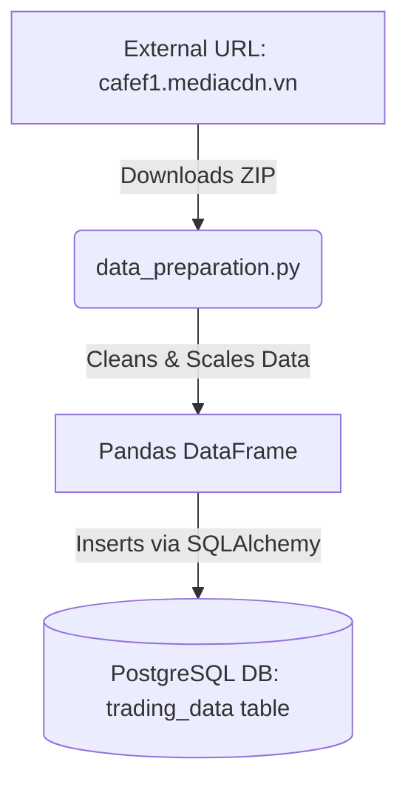
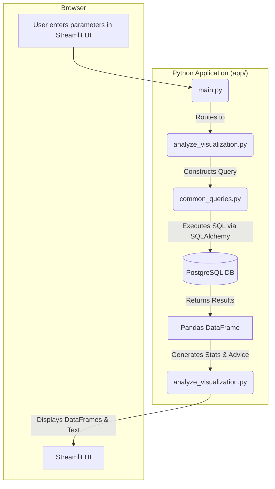

# Application Architecture

**Purpose:** This document describes the technical blueprint of the Stock Analysis App, including its structure, components, and how data moves through the system.

## 1. Technology Stack

- **Backend/UI:** Python, Streamlit
- **Data Processing:** Pandas, pandas-ta
- **Visualization:** Plotly
- **Database:** PostgreSQL
- **Database ORM/Driver:** SQLAlchemy, Psycopg2
- **Containerization:** Docker, Docker Compose
- **Environment Management:** `python-dotenv`

## 2. Folder Structure

A high-level overview of the project's directory structure.

```
/
├── .env                  # Environment variables (DB credentials)
├── docker/
│   ├── docker-compose.yml # Defines and orchestrates Docker services (app, db)
│   └── Dockerfile         # Instructions to build the Python application container
├── requirements.txt      # Python dependencies for product deployment
│
├── app/                  # Main application source code
│   ├── main.py           # Single entry point (Streamlit UI & FastAPI server)
│   ├── apis/             # REST API logic (FastAPI)
│   │   ├── routes.py     # API endpoint definitions
│   │   └── schemas.py    # Pydantic models for API responses
│   ├── commons/          # Shared logic and SQL queries
│   │   ├── common_functions.py # Business logic shared by UI and API
│   │   └── common_queries.py
│   └── pages/            # Streamlit visualization and data pages
│       ├── data_preparation.py
│       ├── analyze_visualization.py
│       ├── suggestion_visualization.py
│       ├── result_visualization.py
│       ├── technical_analysis.py
│       └── technical_visualization.py
│
└── ai-context/           # Documentation for AI assistants
    └── ...
```

## 3. Module Responsibilities

Details on the role of each Python module within the `app/` directory.

- **`main.py`**:
    - **Entry Point:** The script that is executed to run the application.
    - **Environment Loading:** Loads database credentials from the `.env` file.
    - **Service Orchestration:** Manages the lifecycle of both the Streamlit UI and the FastAPI background thread.
    - **Database Initialization:** Establishes a connection to PostgreSQL using `get_engine_with_retry` and initializes the schema with `init_db`.
    - **UI Routing:** Creates the main Streamlit interface, including the sidebar for page navigation. It directs the user to the appropriate page module (`data_page`, `result_page`, etc.) based on their selection.

- **`data_preparation.py`**:
    - **Data Ingestion:** Downloads historical stock data from an external URL (`cafef1.mediacdn.vn`).
    - **Data Processing:** Unzips files, reads CSVs in chunks, cleans data, and applies the `price * 1000` scaling logic.
    - **Database Interaction:** Inserts the processed data into the `trading_data` table, handling duplicates.
    - **Schema Management:** Contains the `init_db` function to create the `trading_data` table if it doesn't exist.

- **`common_queries.py`**:
    - **SQL Abstraction:** Contains reusable SQL query strings as Python constants.
    - **`BASE_DELTA_CALC_CTE`:** The core Common Table Expression for calculating `exact_delta` and `result_delta`.
    - **`COMMON_DELTA_FILTER_WHERE_CLAUSE`:** The standard `WHERE` clause for filtering results based on the user's `delta_target`.

- **`common_functions.py`**:
    - **Shared Analysis:** Contains `analyze_ticker` and indicator calculation logic.
    - **Advice Synthesis:** Contains logic to generate Statistical, Technical, and Final advice strings used by both the UI and the API.

- **`analyze_visualization.py`**:
    - **"Analyze" Page Logic:** Contains all functions for the "Ticker Analyze" and "Portfolio Analyze" tabs.
    - **`get_latest_delta`:** A helper to calculate the current price delta for a single ticker.
    - **`analyze_price_movement`:** Queries the database for a detailed list of every historical instance of a specific signal for one ticker.
    - **`create_analyzed_statistical_report`:** Calculates the probability statistics (Up, Down, No Change) from the results.
    - **`provide_advice`:** Provides a prediction based on the historical statistics.
    - **Portfolio Logic:** Handles batch analysis for multiple tickers using `ThreadPoolExecutor` and the local `analyze_portfolio_ticker` wrapper to combine statistical and technical analysis.
    - **Linear Flow:** The `analyze_page` function orchestrates a strict 1-5 display order (Signal -> Stats -> Tech -> Final -> Explanation) to ensure logical information flow.

- **`pages/suggestion_visualization.py`**:
    - **"Suggestion" Page Logic:** Contains all functions for the market-wide suggestion page.
    - **`get_all_tickers`:** Queries the database for all tickers that meet the liquidity and activity criteria.
    - **Concurrency:** Uses `ThreadPoolExecutor` to run the shared `analyze_ticker` function from `common_functions.py` for all tickers in parallel.

- **`pages/result_visualization.py`**:
    - **"Result" Page Logic:** Contains functions to display general market statistics, such as top tickers by volume or trading value.

- **`pages/technical_analysis.py`**:
    - **Technical UI Logic:** Handles calculations and trend classification requests specifically for the UI, consuming shared functions from `commons/common_functions.py`.

- **`pages/technical_visualization.py`**:
    - **"Technical Analyze" Page Logic:** Handles the UI for the technical analysis page. **It uses `st.session_state` to cache calculation results, preventing redundant computations when UI elements are toggled.** It renders Plotly charts (Price, Volume, and indicators like RSI).

    - **`apis/`**:
    - **`routes.py`**: Defines RESTful endpoints for ticker analysis and programmatic data updates.
    - **`schemas.py`**: Defines Pydantic models for request validation and structured JSON responses.

## 4. Data Flow

### Data Ingestion Flow
This flow describes how raw data is acquired and stored.



### User Analysis Flow (Example: Analyze Page)
This flow describes what happens when a user requests an analysis.



## 5. Database Schema

The primary table used for all analysis.

- **Table:** `trading_data`
- **Primary Key:** `(ticker, date)`
- **Columns:**
    - `ticker` (TEXT): The stock symbol.
    - `date` (DATE): The trading date.
    - `open` (BIGINT): Scaled opening price.
    - `high` (BIGINT): Scaled high price.
    - `low` (BIGINT): Scaled low price.
    - `close` (BIGINT): Scaled closing price.
    - `volume` (BIGINT): Trading volume.
- **Index:** `idx_ticker_date` on `(ticker, date DESC)` for efficient time-series queries.